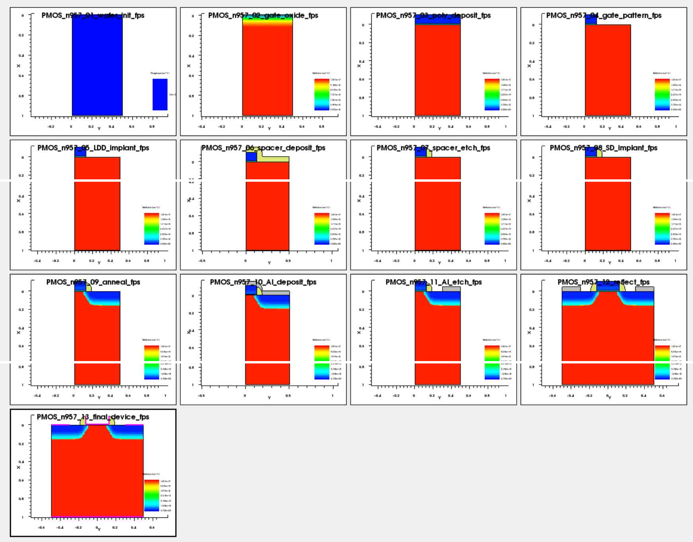

# 01. Project Overview

## 이 페이지에서 확인할 내용

| Item | Description |
|---|---|
| Purpose | SimpleMOS nMOS 예제를 pMOS 공정으로 변환하고 공정 조건 최적화 |
| Method | SProcess–SDevice–SVisual 수정 후 Workbench split 비교 |
| Metrics | Ion, Ioff, SS, Vtgm, gm, Ion/Ioff |
| Final decision | `Ion/Ioff–SS` 그래프 기반 조건 선택 |

## Problem Definition

기존 SimpleMOS 예제는 nMOS 공정을 기준으로 구성되어 있습니다. pMOS를 구현하려면 body와 Source/Drain의 도핑 극성, implant species, gate/drain bias 방향, 전류 처리 방식이 함께 바뀌어야 합니다.

이 프로젝트에서는 다음 질문을 순서대로 해결했습니다.

1. nMOS 예제를 pMOS 공정으로 어떻게 변환할 것인가?
2. pMOS가 음의 gate voltage에서 정상 동작하는가?
3. 공정 parameter가 Ion, Ioff, SS에 어떤 영향을 주는가?
4. 여러 지표의 trade-off를 어떤 기준으로 비교할 것인가?
5. 제한된 split 범위에서 어떤 조건이 가장 균형적인가?

## Main Workflow

```text
Preliminary TCAD practice
→ nMOS-to-pMOS conversion
→ process structure verification
→ pMOS bias verification
→ automated metric extraction
→ Method 1 numerical optimization
→ Method 2 Ion/Ioff–SS optimization
→ final device comparison
```



*Figure. 최종 pMOS 공정을 검증하기 위해 저장한 13개 TDR checkpoint.*

## Final Result

| Parameter | Final Value |
|---|---:|
| LDD_Dose / LDD_E | `3e13 cm^-2` / 3 keV |
| SD_Dose / SD_E | `5e16 cm^-2` / 10 keV |
| RTA | 3 s |
| Spacer_Dep | 0.30 |
| Ion | `1.35e-04 A/µm` |
| Ioff | `4.93e-16 A/µm` |
| SS | 85.181 mV/dec |
| Vtgm | -1.1421 V |


*Figure. 수치 비교 방식과 그래프 기반 방식에서 선택한 최종 후보 비교.*

그래프 기반 조건은 수치 비교 조건보다 Ion이 약 9.2% 낮았지만, Ioff가 약 68.1% 감소했고 SS도 약 0.56% 개선되었습니다. 목표 Ion을 충분히 만족했기 때문에 전체 switching/leakage 균형이 더 좋은 조건으로 판단했습니다.

## Next Pages

- [Preliminary Coursework](./02_preliminary_coursework.md)
- [nMOS-to-pMOS Conversion](./03_nmos_to_pmos_conversion.md)
- [SProcess Implementation](./04_sprocess_implementation.md)
- [SDevice Bias Setup](./05_sdevice_bias_setup.md)
- [SVisual Metric Extraction](./06_svisual_metric_extraction.md)

**Summary:**  
This project combines process conversion, structural verification, automated extraction, and two multi-variable optimization methods.
