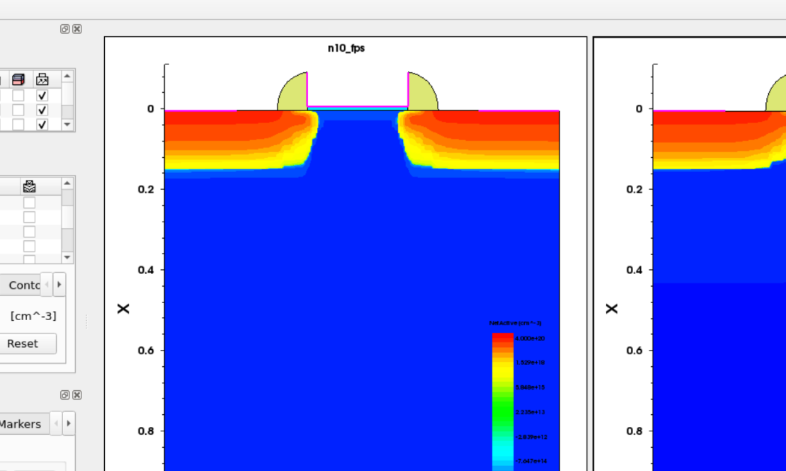
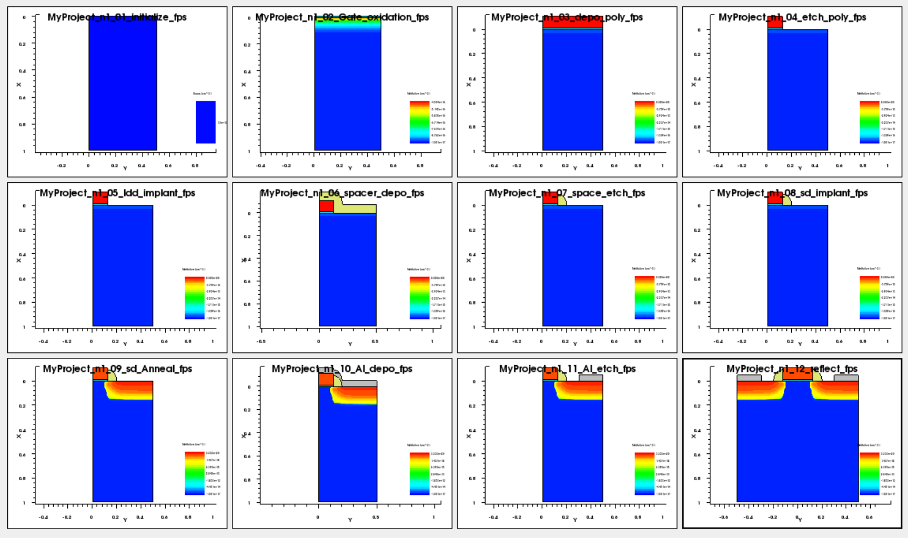
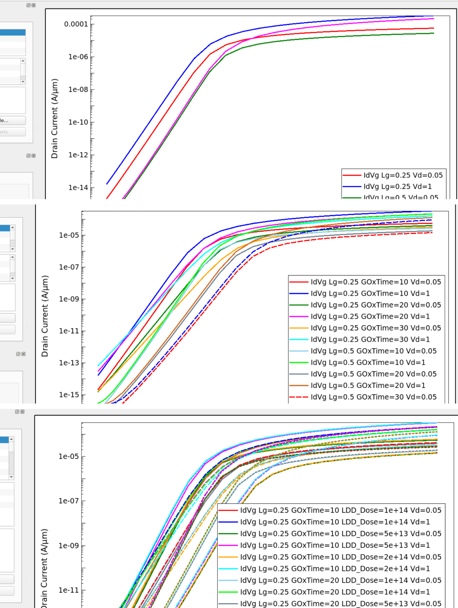

# 02. Preliminary Coursework

## 이 단계에서 확인할 내용

| Item | Description |
|---|---|
| Purpose | Sentaurus 공정 흐름과 parameter sweep 해석 방법 학습 |
| Method | 구조 비교, TDR checkpoint, Lg/GOxTime/LDD sweep |
| Parameters | Lg, GOxTime, LDD_Dose, SD_Dose |
| Output | 공정 구조 변화와 Id–Vg 경향 파악 |
| Source | [Preliminary TDR example](../source/coursework/tdr_checkpoint_example.cmd) |

최종 pMOS 과제 전에 nMOS SimpleMOS 예제를 이용해 Sentaurus Workbench, SProcess, SDevice, SVisual의 기본 흐름을 익혔습니다. 이 과정은 최종 최적화의 기준 조건과 DOE 해석 방법을 정리하는 선행 단계였습니다.

## 1. Structure Comparison

*Figure. 초기 실습에서 비교한 MOS 구조와 도핑 분포.*

구조 화면을 통해 gate, spacer, Source/Drain, well 영역이 공정 command에 따라 어떻게 형성되는지 확인했습니다.

## 2. Process Checkpoints

*Figure. 선행 실습에서 저장한 공정 단계별 TDR 구조.*

공정 직후마다 TDR을 저장해 oxide, poly, implant, spacer, anneal, metal 단계가 의도한 순서로 진행되는지 확인했습니다.

## 3. Parameter Sweep

*Figure. Lg, GOxTime, LDD 조건 변화에 따른 Workbench 결과와 Id–Vg 변화.*

### Lg

- 짧은 gate length는 더 높은 current를 보일 수 있지만 leakage와 short-channel effect에 불리할 수 있음
- 긴 gate length는 gate control에 유리하지만 current가 감소할 수 있음

### GOxTime

- 산화 시간이 증가하면 oxide thickness가 증가
- Vtgm과 SS가 변하고 drive current가 감소하는 경향을 확인

### LDD_Dose

- extension resistance와 drain-side electric field 사이의 trade-off를 확인
- 최종 pMOS 최적화에서 dose와 energy를 분리해 비교해야 할 필요성을 확인

## Role in the Final Project

선행 실습의 목적은 최종 조건을 확정하는 것이 아니라 다음 작업을 수행할 수 있는 기반을 만드는 것이었습니다.

- Workbench parameter split 구성
- 공정 단계별 TDR 저장
- Id–Vg curve 비교
- `Vtgm`, `Id`, `SS`, `gm` 결과 해석
- 공정 parameter와 전기적 특성 연결

[Next: nMOS-to-pMOS Conversion](./03_nmos_to_pmos_conversion.md)

**Summary:**  
The preliminary coursework established the Sentaurus workflow, TDR verification method, and parameter-sweep interpretation used in the final pMOS project.
