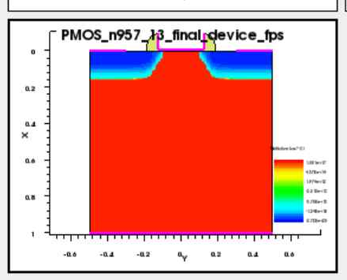

# 03. nMOS-to-pMOS Conversion

## 이 단계에서 확인할 내용

| Item | Description |
|---|---|
| Purpose | nMOS SimpleMOS 공정을 pMOS 동작에 맞게 변환 |
| Method | body, implant species, bias direction, current processing 변경 |
| Main changes | PWell→NWell, n-type implant→BF2, positive bias→negative bias |
| Output | enhancement-mode pMOS transfer curve |
| Related source | [SProcess](../source/sprocess/pmos_process_modifications.cmd), [SDevice](../source/sdevice/pmos_bias_sweep.cmd), [SVisual](../source/svisual/pmos_metric_extraction.tcl) |

pMOS 변환은 전압 부호 하나를 바꾸는 작업이 아닙니다. channel이 형성되는 body 극성, Source/Drain dopant, extension 영역, bias 방향, 전류 부호 처리를 함께 바꿔야 합니다.

## Conversion Summary

| nMOS Configuration | pMOS Configuration | Reason |
|---|---|---|
| PWell / Boron | NWell / Phosphorus | p-channel 형성을 위한 n-type body |
| Arsenic LDD | BF2 LDD | p-type extension 형성 |
| Phosphorus S/D | BF2 p+ S/D | pMOS Source/Drain 형성 |
| Positive Vg, Vd | Negative Vg, Vd | hole channel 형성 및 pMOS 동작 |
| Signed drain current | `abs(Id)` | magnitude 기준 비교와 metric 추출 |

## Final Structure



*Figure. NWell, p-type LDD, p+ Source/Drain, spacer와 contact가 형성된 최종 pMOS 구조.*

구조 확인 항목은 다음과 같습니다.

- gate 양쪽에 p-type LDD 형성
- spacer 바깥쪽에 p+ Source/Drain 형성
- anneal 이후 junction 확산
- reflect 이후 좌우 대칭 구조
- final device에서 contact 정의

## Electrical Direction


*Figure. 음의 gate voltage에서 `|Id|`가 증가하는 pMOS transfer curve.*

- Vg = 0 V 부근에서 off-state current가 작음
- Vg가 -2.5 V 방향으로 이동할수록 hole channel이 형성되고 `|Id|`가 증가
- Vd = -1.0 V curve가 Vd = -0.05 V보다 높은 current를 보임
- Vtgm이 음수로 추출되어 pMOS threshold 방향을 확인

## Why Current Magnitude Was Used

SVisual에서 pMOS drain current는 부호를 포함해 출력될 수 있습니다. nMOS와 같은 기준으로 `Ion`, `Ioff`, `SS`, `gm`을 비교하기 위해 drain current의 절대값을 사용했습니다.

```tcl
set Ids {}
foreach i $IdsRaw {
    lappend Ids [expr {abs($i)}]
}
```

[Next: SProcess Implementation](./04_sprocess_implementation.md)

**Summary:**  
The conversion changes the body, implant species, electrical bias direction, and current-processing method required for valid pMOS operation.
