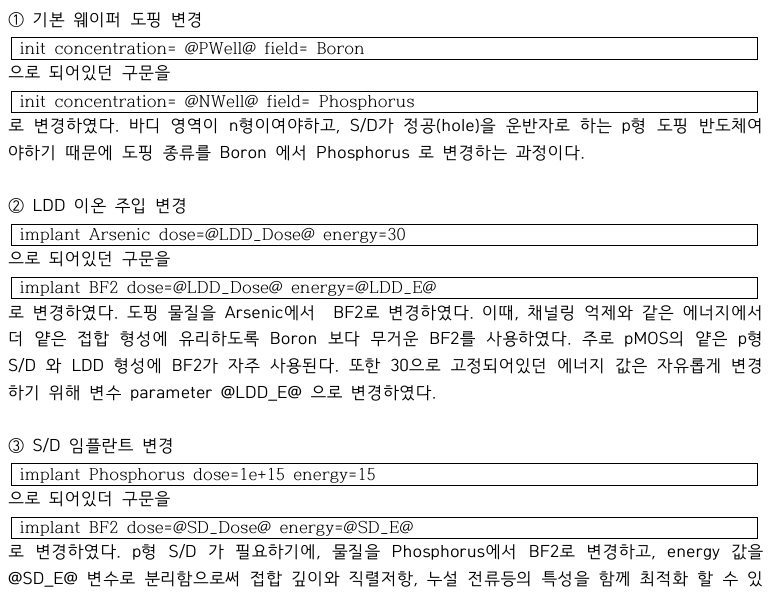
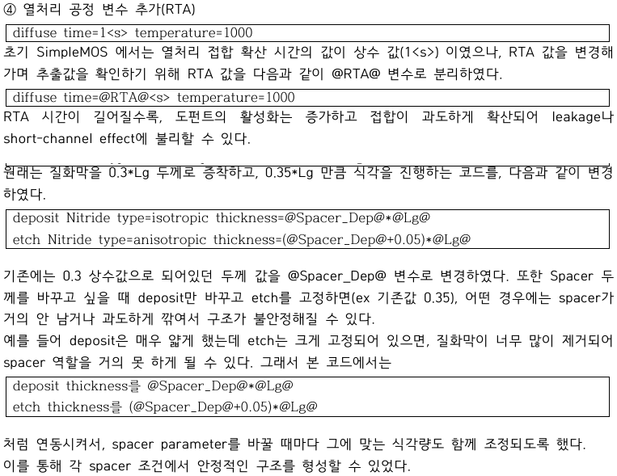

# 04. SProcess Implementation

## 이 단계에서 확인할 내용

| Item | Description |
|---|---|
| Purpose | pMOS 구조와 최적화 parameter를 SProcess에 구현 |
| Method | well, LDD, S/D, RTA, spacer command 변경 |
| Parameters | NWell, LDD_Dose, LDD_E, SD_Dose, SD_E, RTA, Spacer_Dep |
| Output | parameter에 따라 달라지는 pMOS 공정 구조 |
| Source | [pmos_process_modifications.cmd](../source/sprocess/pmos_process_modifications.cmd) |

## 1. NWell and p-type Implant



*Figure. NWell 초기화와 BF2 기반 LDD·Source/Drain implant command.*

```tcl
init concentration=@NWell@ field=Phosphorus
implant BF2 dose=@LDD_Dose@ energy=@LDD_E@
implant BF2 dose=@SD_Dose@ energy=@SD_E@
```

### NWell

pMOS channel이 형성될 n-type body를 만들기 위해 Boron 기반 PWell을 Phosphorus 기반 NWell로 변경했습니다.

### LDD

LDD dose와 energy를 각각 parameter로 분리했습니다.

- `LDD_Dose`: extension 영역의 농도와 저항에 영향
- `LDD_E`: implant depth와 drain-side field 분포에 영향

### Source/Drain

p+ Source/Drain 형성을 위해 BF2를 사용하고 dose와 energy를 Workbench parameter로 분리했습니다.

- 높은 dose: series resistance 감소에 유리
- 높은 energy: 깊은 junction 형성 가능
- 과도한 dose/energy: leakage와 SS에 불리할 수 있음

## 2. RTA and Spacer



*Figure. RTA 시간과 spacer 두께를 Workbench parameter로 연결한 command.*

```tcl
diffuse time=@RTA@<s> temperature=1000

deposit Nitride type=isotropic thickness=@Spacer_Dep@*@Lg@
etch Nitride type=anisotropic thickness=(@Spacer_Dep@+0.05)*@Lg@
```

### RTA

1000 °C 조건에서 anneal time을 3, 5, 7 s로 비교했습니다.

- 짧은 RTA: activation 부족 가능
- 긴 RTA: junction diffusion과 leakage 증가 가능

### Spacer

deposit과 anisotropic etch 두께를 같은 parameter에 연동했습니다.

- thin spacer: Source/Drain 접근성과 Ion에 유리할 수 있음
- thick spacer: drain field 완화와 leakage 억제에 유리할 수 있음
- deposit만 바꾸고 etch를 고정하면 spacer 형상이 의도와 다르게 남을 수 있어 두 command를 함께 변경

## 3. Structural Check


*Figure. 공정 command 적용 후 단계별로 저장한 구조.*

공정 조건을 변경한 뒤 최종 전기적 결과만 확인하지 않고 TDR checkpoint로 implant 위치, spacer 잔류, junction diffusion을 함께 점검했습니다.

[Next: SDevice Bias Setup](./05_sdevice_bias_setup.md)

**Summary:**  
SProcess was modified to parameterize the pMOS well, implants, anneal, and spacer while preserving a structurally verifiable process flow.
