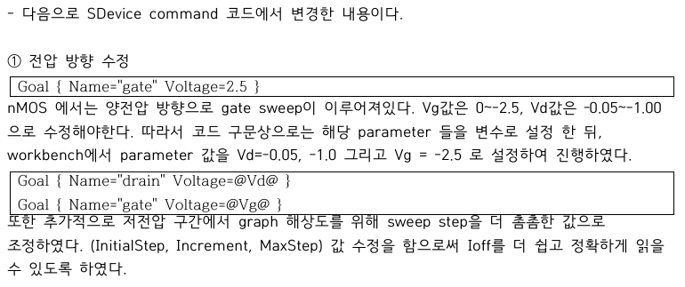
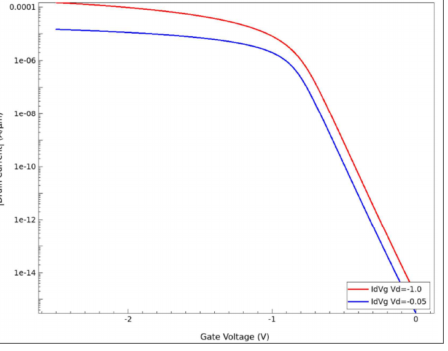

# 05. SDevice Bias Setup

## 이 단계에서 확인할 내용

| Item | Description |
|---|---|
| Purpose | pMOS transfer curve를 얻기 위한 음전압 bias 구성 |
| Method | drain bias 설정 후 gate voltage를 0 V에서 음의 방향으로 sweep |
| Bias | Vd = -0.05, -1.0 V / Vg = -2.5 V |
| Output | enhancement-mode pMOS Id–Vg curve |
| Source | [pmos_bias_sweep.cmd](../source/sdevice/pmos_bias_sweep.cmd) |

## Bias Command



*Figure. Workbench parameter를 이용한 pMOS drain/gate bias 설정.*

```tcl
Goal { Name="drain" Voltage=@Vd@ }
Goal { Name="gate" Voltage=@Vg@ }
```

Workbench에서는 다음 조건을 사용했습니다.

```text
Vd = -0.05 V, -1.0 V
Vg = -2.5 V
```

gate sweep의 `InitialStep`, `Increment`, `MaxStep`도 조정해 Vg = 0 V와 -2.5 V 부근의 sampled point가 목표 bias에 충분히 가깝도록 구성했습니다.

## Transfer Curve Verification



*Figure. 두 drain bias에서 얻은 pMOS transfer curve.*

### Off-state

Vg가 0 V에 가까울 때 current가 매우 작아 pMOS가 off 상태에 있음을 확인했습니다.

### Turn-on

Vg가 음의 방향으로 증가할수록 `|Id|`가 증가해 hole channel이 형성되는 방향과 일치했습니다.

### Drain Bias

Vd = -1.0 V에서 Vd = -0.05 V보다 높은 current가 나타났습니다. 최종 성능 비교는 Vd = -1.0 V 조건을 기준으로 진행했습니다.

## Verification Result

- negative Vtgm 확인
- Vg = -2.5 V에서 충분한 Ion 확인
- Vg = 0 V에서 낮은 Ioff 확인
- pMOS transfer direction 정상 확인

다음 단계에서는 이 curve에서 metric을 자동 추출했습니다.

[Next: SVisual Metric Extraction](./06_svisual_metric_extraction.md)

**Summary:**  
Negative drain and gate sweeps were configured to verify enhancement-mode pMOS operation and provide consistent data for automatic metric extraction.
