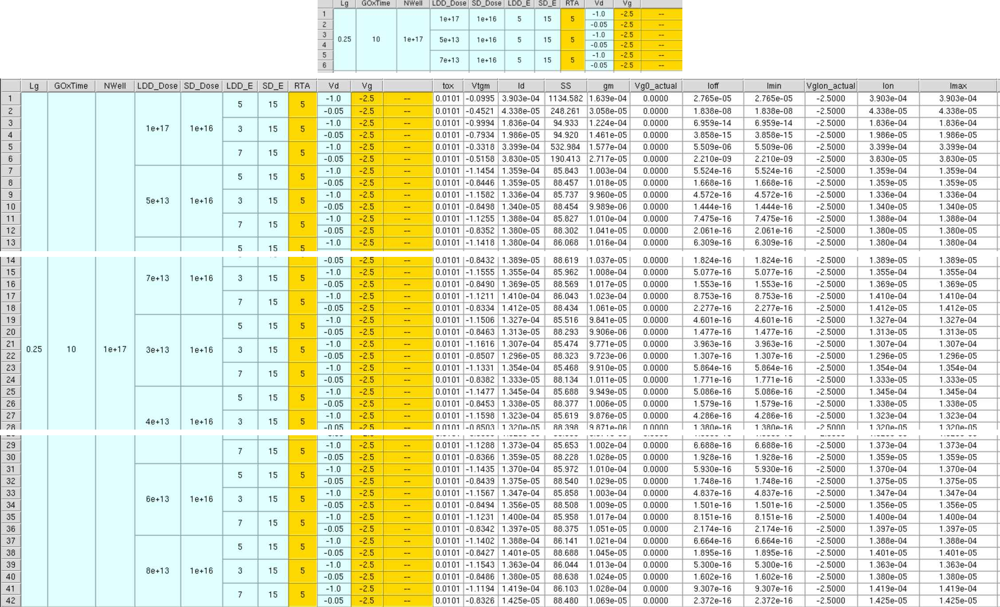
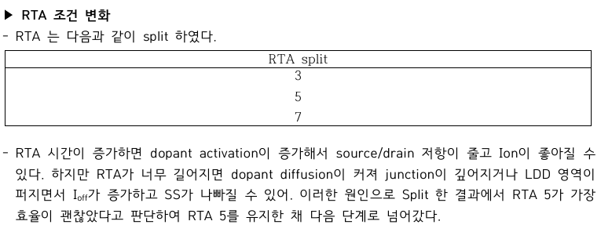
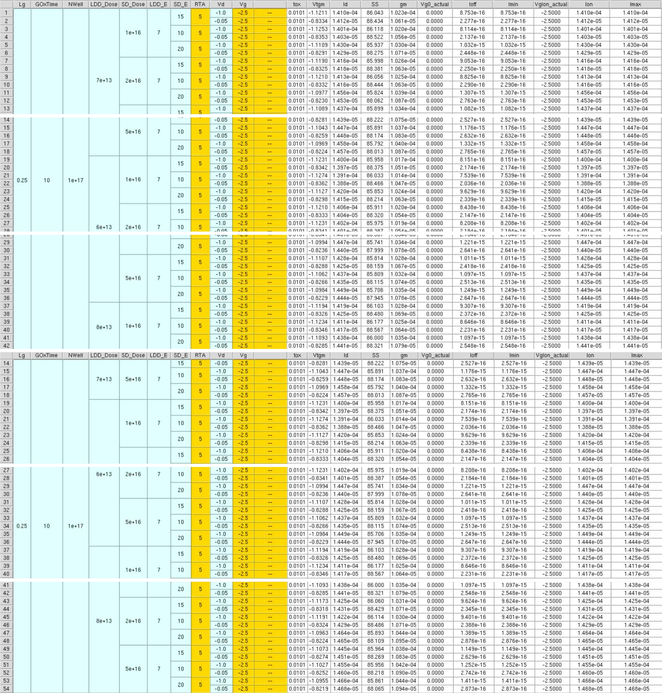
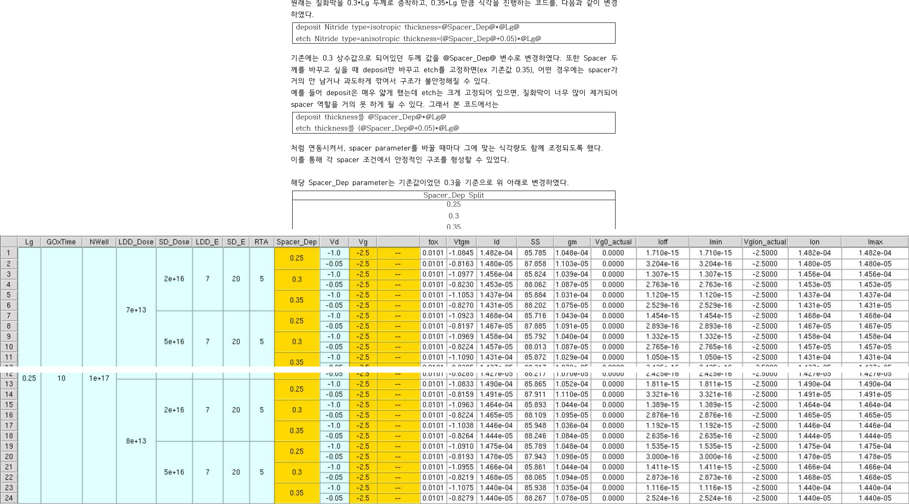
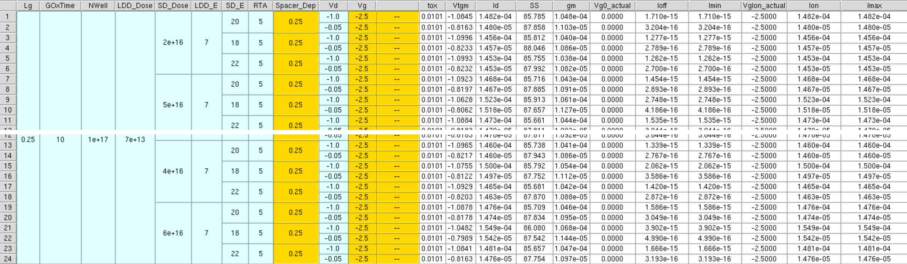
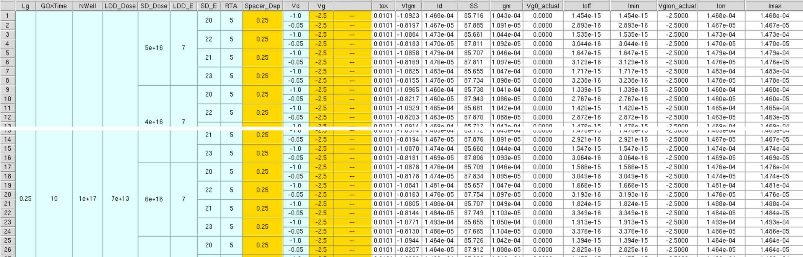
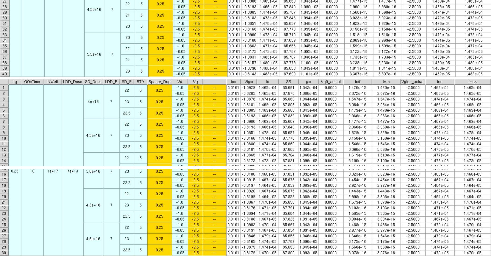
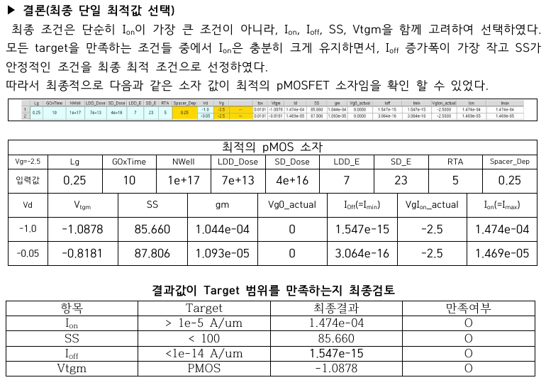

# 08. Method 1 — Numerical Optimization

## 이 방법에서 확인할 내용

| Item | Description |
|---|---|
| Purpose | 각 metric의 값과 변화율을 직접 비교해 후보 축소 |
| Metrics | Ion, Ioff, SS, Vtgm, gm |
| Sequence | LDD → RTA → Source/Drain → Spacer → Fine Split ×3 |
| Decision style | target 만족 여부와 개별 수치 비교 |
| Result | 높은 Ion을 확보한 practical candidate |

## 1. Baseline and LDD Split

초기 `LDD_Dose = 1e14` 조건은 Ioff와 SS가 target을 만족하지 못했습니다. Dose를 낮추고 energy를 3, 5, 7 keV로 분리했습니다.

```text
LDD_Dose = 3e13, 4e13, 5e13, 6e13, 7e13, 8e13 cm^-2
LDD_E    = 3, 5, 7 keV
```



*Figure. LDD dose와 energy에 따른 Workbench 결과 비교.*

### 판단

- 3 keV 조건은 leakage가 낮지만 Ion이 상대적으로 낮음
- 7 keV 조건은 target 범위 안에서 Ion이 큰 경향
- 수치 비교 방식에서는 Ion 확보를 중시해 `LDD_E = 7 keV`, `LDD_Dose = 6e13–8e13` 후보를 유지

낮은 dose 후보를 제외한 판단은 Method 2에서 다시 검토했습니다.

## 2. RTA Split

```text
RTA = 3, 5, 7 s
```



*Figure. 1000 °C에서 RTA 시간을 3, 5, 7 s로 비교한 결과.*

- 짧은 RTA는 activation 부족 가능
- 긴 RTA는 diffusion과 leakage 증가 가능
- 수치 비교에서는 `RTA = 5 s`를 다음 단계 기준으로 선택

## 3. Source/Drain Split

```text
SD_Dose = 1e16, 2e16, 5e16 cm^-2
SD_E    = 10, 15, 20 keV
```



*Figure. Source/Drain dose와 energy split 결과.*

- `SD_Dose = 1e16`: leakage는 양호하지만 Ion 확보가 불리
- `2e16`, `5e16`: Ion 증가와 target 유지
- `SD_E = 20 keV`: 초기 탐색에서 높은 Ion을 보이는 경향

## 4. Spacer Split

```text
Spacer_Dep = 0.25, 0.30, 0.35
```



*Figure. spacer 두께 변화에 따른 성능 비교.*

- thin spacer: series resistance 감소와 Ion 증가에 유리할 수 있음
- thick spacer: drain field 완화와 leakage 억제에 유리할 수 있음
- 수치 비교에서는 `Spacer_Dep = 0.25`를 선택

## 5. Fine Split

### Fine Split 1

```text
SD_Dose = 4e16, 5e16, 6e16 cm^-2
SD_E    = 18, 20, 22 keV
```



### Fine Split 2

```text
SD_Dose = 4.5e16, 5.0e16, 5.5e16 cm^-2
SD_E    = 21, 22, 23 keV
```



### Fine Split 3

```text
SD_Dose = 3.8e16, 4.2e16, 4.6e16 cm^-2
SD_E    = 22, 22.5, 23 keV
```



*Figure. Source/Drain 후보 주변을 세 차례 세분화한 결과.*

## Selected Device



*Figure. 수치 비교 방식에서 선택한 최종 조건과 target 검증.*

| Parameter | Value |
|---|---:|
| LDD_Dose / LDD_E | `7e13` / 7 keV |
| SD_Dose / SD_E | `4e16` / 23 keV |
| RTA | 5 s |
| Spacer_Dep | 0.25 |
| Ion | `1.474e-04 A/µm` |
| Ioff | `1.547e-15 A/µm` |
| SS | 85.660 mV/dec |
| gm | `1.044e-04` |

이 방식은 높은 Ion 후보를 찾는 데 유리했지만, 여러 metric이 반대 방향으로 변할 때 전체 trade-off를 한눈에 판단하기 어려웠습니다.

[Next: Method 2 Plot Optimization](./09_method2_plot_optimization.md)

**Summary:**  
The numerical method produced a high-drive-current candidate through sequential filtering and three source/drain fine splits.
