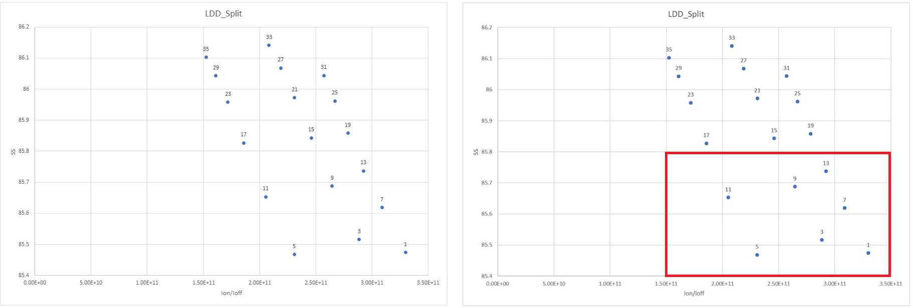
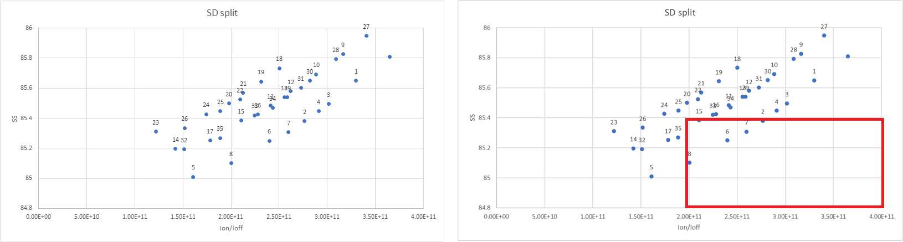
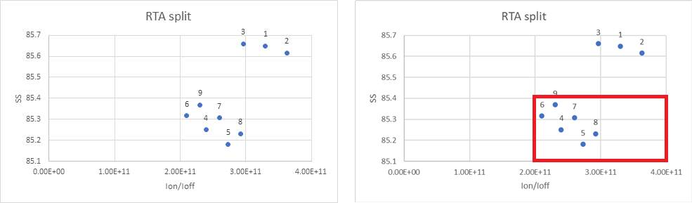
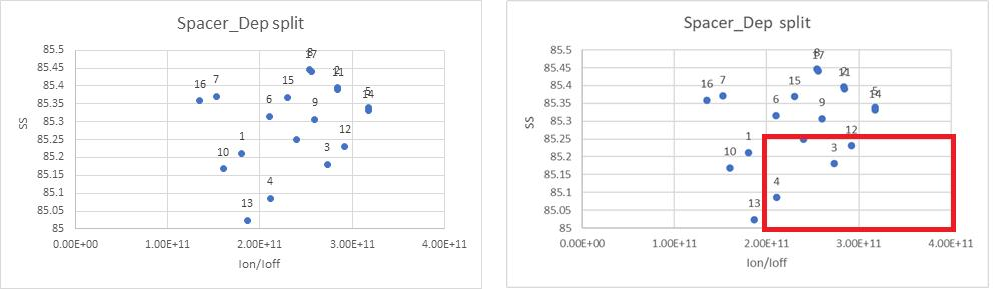
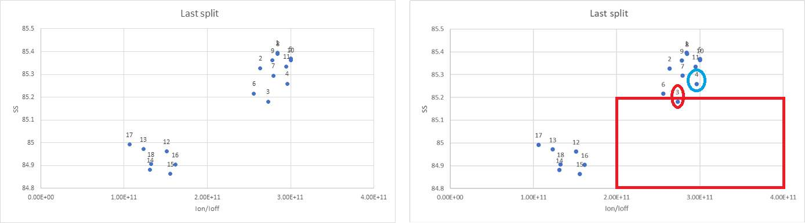
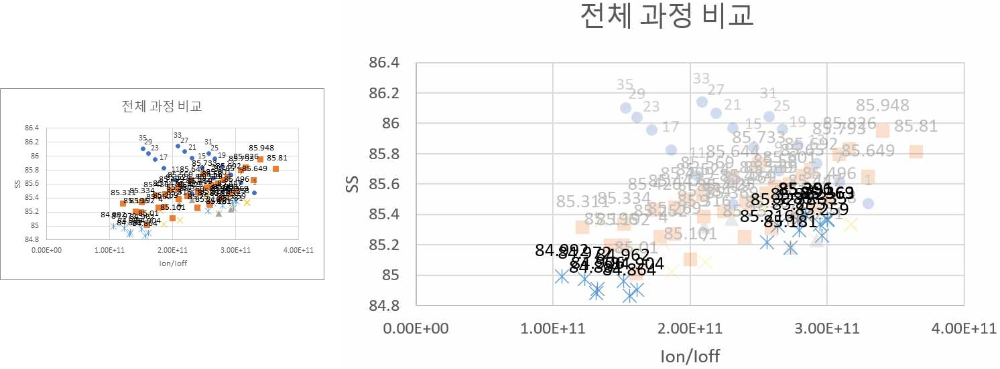

# 09. Method 2 — Ion/Ioff–SS Plot Optimization

## 이 방법에서 확인할 내용

| Item | Description |
|---|---|
| Purpose | on/off current ratio와 gate control을 동시에 비교 |
| x-axis | `Ion/Ioff`, larger is better |
| y-axis | `SS`, smaller is better |
| Preferred region | lower-right |
| Sequence | LDD → Source/Drain → RTA → Spacer → Fine Split |
| Result | lower leakage and improved SS candidate |

수치 비교에서 초기 제외했던 조건도 다시 포함해 후보 분포를 확인했습니다. 각 단계에서 오른쪽 아래에 위치한 조건을 중심으로 다음 split을 구성했습니다.

## 1. LDD Split



*Figure. LDD 조건별 `Ion/Ioff–SS` 분포와 우수 후보 영역.*

낮은 LDD_Dose는 Ion이 약간 감소하더라도 Ioff가 더 크게 억제되어 `Ion/Ioff`가 증가하는 경우가 있었습니다.

다음 단계 대표 후보:

```text
3e13/3, 3e13/5, 3e13/7, 4e13/3
```

## 2. Source/Drain Split

```text
SD_Dose = 1e16, 3e16, 5e16 cm^-2
SD_E    = 10, 15, 20 keV
```



*Figure. Source/Drain dose와 energy에 따른 후보 분포.*

- 높은 dose는 Source/Drain resistance 감소에 유리
- 높은 energy는 junction depth와 leakage를 증가시킬 수 있음
- `SD_Dose = 5e16`, `SD_E = 10–15 keV` 주변을 우수 후보로 유지

## 3. RTA Split



*Figure. RTA 3, 5, 7 s 조건의 `Ion/Ioff–SS` 비교.*

RTA보다 Source/Drain dose/energy 조합의 영향이 더 크게 나타났습니다. 낮은 dose를 RTA 증가만으로 보완하기는 어려웠고, 높은 energy와 긴 RTA 조합은 diffusion과 leakage에 불리할 수 있었습니다.

## 4. Spacer Split



*Figure. Spacer_Dep 조건에 따른 우수 후보 영역.*

`Spacer_Dep = 0.30–0.35` 영역에서 leakage 억제와 series resistance 사이의 균형이 상대적으로 우수했습니다.

## 5. Fine Split

```text
SD_E       = 12.5 keV
RTA        = 4 s
Spacer_Dep = 0.325
```

기존 우수 후보 주변에 중간값을 추가해 비교했습니다.



*Figure. 우수 후보 주변 중간값을 추가한 fine split.*

점들은 다음 두 그룹으로 나뉘었습니다.

- low SS but lower Ion/Ioff
- high Ion/Ioff but slightly higher SS

최종 선택에서는 Ion/Ioff 최대값만 고르지 않고 충분히 높은 전류비와 `SS ≤ 85.2 mV/dec`를 함께 만족하는 후보를 선택했습니다.

## Selected Candidate



*Figure. 전체 후보 분포에서 선택한 최종 그래프 기반 조건.*

| Parameter | Value |
|---|---:|
| LDD_Dose / LDD_E | `3e13` / 3 keV |
| SD_Dose / SD_E | `5e16` / 10 keV |
| RTA | 3 s |
| Spacer_Dep | 0.30 |
| Ion | `1.35e-04 A/µm` |
| Ioff | `4.93e-16 A/µm` |
| SS | 85.181 mV/dec |
| gm | `9.91e-05` |

[Next: Method Comparison and Final Device](./10_method_comparison_and_final.md)

**Summary:**  
The plot-based method restored candidates discarded by numerical filtering and selected a device with a stronger Ion/Ioff and SS balance.
