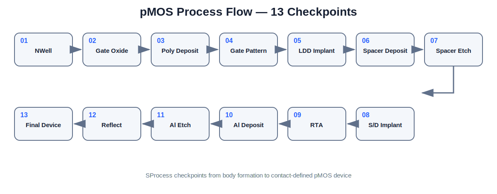
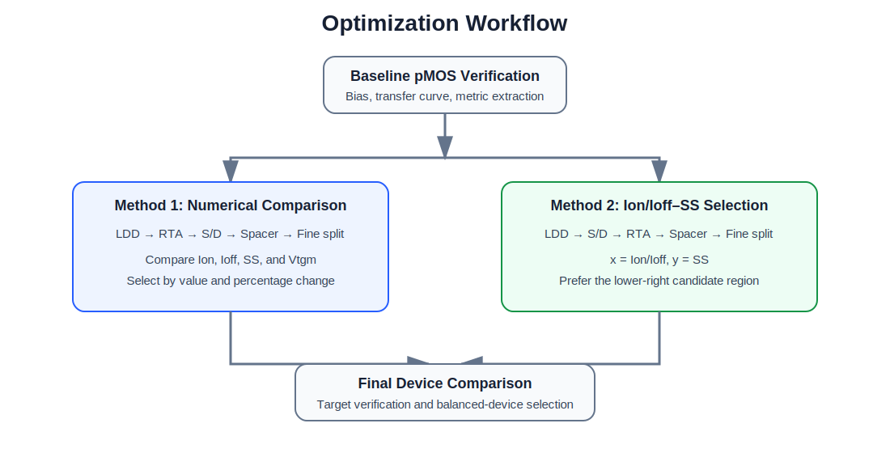

# P-type MOSFET Process Optimization using Sentaurus TCAD

## 1. Project Overview

기존 Sentaurus SimpleMOS nMOS 예제를 pMOS 공정으로 변환하고, 공정 변수에 따른 전기적 특성을 분석한 프로젝트입니다.

SProcess에서 well과 implant 극성을 변경하고, SDevice에서 pMOS 바이어스를 설정했습니다. SVisual에서는 pMOS 전류를 절대값으로 처리하고 `Ion`, `Ioff`, `SS`, `Vtgm`, `gm`을 자동 추출했습니다.

최적화는 두 방식으로 진행했습니다.

1. 개별 수치와 증감률 비교
2. `Ion/Ioff–SS` 그래프 기반 후보 선택

최종 소자는 높은 on/off 전류비와 낮은 SS를 함께 확보한 그래프 기반 조건으로 선정했습니다.

> 코드 변경, 공정 흐름, 최적화 과정을 자세히 보고 싶다면 [13. Detailed Documents](#13-detailed-documents)에서 확인할 수 있습니다.

**Summary:**  
This project converts a SimpleMOS nMOS process into a pMOS flow and compares numerical and `Ion/Ioff–SS` plot-based optimization methods.

---

## 2. Project Information

| Item | Description |
|---|---|
| Course | Semiconductor Integrated Process |
| Period | 2026.03–2026.06 |
| Tool | Synopsys Sentaurus TCAD T-2022.03 |
| Modules | Sentaurus Workbench, SProcess, SDevice, SVisual |
| Device | Planar pMOSFET |
| Status | Completed |

---

## 3. Problem Definition and Targets

공정 변수는 서로 영향을 주기 때문에 한 지표만 최대화하면 다른 특성이 악화될 수 있습니다.

- 높은 `Ion`: strong drive current
- 낮은 `Ioff`: low leakage
- 낮은 `SS`: sharp switching
- 음의 `Vtgm`: normal pMOS behavior

| Target | Criterion |
|---|---:|
| Ion at Vg = -2.5 V | `> 1e-5 A/µm` |
| Ioff at Vg = 0 V | `< 1e-14 A/µm` |
| SS | `< 100 mV/dec` |
| Vtgm | Negative |

---

## 4. nMOS-to-pMOS Conversion

| Item | SimpleMOS nMOS | Converted pMOS |
|---|---|---|
| Body | P-type | N-type |
| Well dopant | Boron | Phosphorus |
| LDD implant | Arsenic | BF2 |
| Source/Drain implant | Phosphorus | BF2 |
| Gate sweep | Positive | 0 to -2.5 V |
| Drain bias | Positive | -0.05 and -1.0 V |
| Current interpretation | Raw current | Absolute current |

**Summary:**  
The pMOS conversion required changes to well polarity, implant species, bias direction, and current processing.

---

## 5. Sentaurus Workflow

```text
Sentaurus Workbench
        ↓
SProcess: pMOS process construction and TDR checkpoints
        ↓
SDevice: pMOS bias sweep and electrical simulation
        ↓
SVisual: metric extraction and DOE result comparison
```

Extracted metrics:

- `Vtgm`
- `Ion`
- `Ioff`
- `SS`
- `gm`
- `Vg0_actual`
- `VgIon_actual`

---

## 6. Process Flow Visualization



The structure was checked at thirteen points from NWell formation to the final contact-defined device.

| Step | Process |
|---:|---|
| 1 | NWell formation |
| 2 | Gate oxidation |
| 3 | Poly deposition |
| 4 | Gate patterning |
| 5 | LDD implant |
| 6 | Spacer deposition |
| 7 | Spacer etch |
| 8 | Source/Drain implant |
| 9 | RTA |
| 10 | Al deposition |
| 11 | Al etch |
| 12 | Reflect |
| 13 | Contact definition and final device |

---

## 7. pMOS Operation Verification

The transfer curve was checked before optimization.

- Current remained low near `Vg = 0 V`.
- `|Id|` increased as the gate voltage became more negative.
- Current at `Vd = -1.0 V` was larger than at `Vd = -0.05 V`.

These results confirmed normal enhancement-mode pMOS operation.

---

## 8. Optimization Strategy



The process variables were evaluated in this order:

```text
Baseline verification
→ LDD_Dose and LDD_E
→ RTA
→ SD_Dose and SD_E
→ Spacer_Dep
→ Fine split
→ Final method comparison
```

| Method | Selection Basis |
|---|---|
| Method 1 | Direct comparison of Ion, Ioff, SS, and Vtgm |
| Method 2 | Candidate position on the Ion/Ioff–SS plane |

---

## 9. Method 1 – Numerical Comparison

Method 1 compared extracted values and percentage changes at each split.

Selected condition:

| Parameter | Value |
|---|---:|
| LDD_Dose | `7e13 cm⁻²` |
| LDD_E | 7 keV |
| SD_Dose | `4e16 cm⁻²` |
| SD_E | 23 keV |
| RTA | 5 s |
| Spacer_Dep | 0.25 |

| Metric | Result |
|---|---:|
| Ion | `1.474e-04 A/µm` |
| Ioff | `1.547e-15 A/µm` |
| SS | 85.660 mV/dec |
| Vtgm | -1.0878 V |

This method preserved high Ion, but the multi-metric trade-off was difficult to judge from separate values alone.

---

## 10. Method 2 – Ion/Ioff–SS Selection

Method 2 used the following comparison plane:

```text
x = Ion/Ioff
 y = SS
```

- Right: higher on/off current ratio
- Down: lower SS
- Preferred region: lower-right

The final candidate was selected after LDD, S/D, RTA, spacer, and fine-split comparisons.

Selected condition:

| Parameter | Value |
|---|---:|
| LDD_Dose | `3e13 cm⁻²` |
| LDD_E | 3 keV |
| SD_Dose | `5e16 cm⁻²` |
| SD_E | 10 keV |
| RTA | 3 s |
| Spacer_Dep | 0.30 |

**Summary:**  
Method 2 selected the device with the stronger combined Ion/Ioff and SS performance.

---

## 11. Optimization Method Comparison


| Metric | Numerical Method | Plot-Based Method |
|---|---:|---:|
| Ion | `1.474e-04` | `1.35e-04` |
| Ioff | `1.547e-15` | `4.93e-16` |
| SS | 85.660 | 85.181 |
| gm | `1.044e-04` | `9.91e-05` |

Compared with the numerical-method device, the plot-based device showed:

- Ion: about 9.2% lower
- gm: about 5.3% lower
- Ioff: about 68.1% lower
- SS: about 0.56% lower

The plot-based condition was selected because the leakage reduction was large while Ion remained above the target.

---

## 12. Final Device

| Parameter | Final Value |
|---|---:|
| Lg | 0.25 |
| GOxTime | 10 |
| NWell | `1e17 cm⁻³` |
| LDD_Dose | `3e13 cm⁻²` |
| LDD_E | 3 keV |
| SD_Dose | `5e16 cm⁻²` |
| SD_E | 10 keV |
| RTA | 3 s |
| Spacer_Dep | 0.30 |
| Vg | -2.5 V |
| Vd | -1.0 V |

| Metric | Final Result | Target | Result |
|---|---:|---:|---|
| Ion | `1.35e-04 A/µm` | `> 1e-5` | Pass |
| Ioff | `4.93e-16 A/µm` | `< 1e-14` | Pass |
| SS | 85.181 mV/dec | `< 100` | Pass |
| Vtgm | -1.1421 V | pMOS | Pass |

---

## 13. Detailed Documents

| Document | Description |
|---|---|
| [01. Project Overview](./docs/01_project_overview.md) | Scope and workflow |
| [02. Preliminary Coursework](./docs/02_preliminary_coursework.md) | Early Sentaurus practice |
| [03. nMOS-to-pMOS Conversion](./docs/03_nmos_to_pmos_conversion.md) | Conversion requirements |
| [04. SProcess Modifications](./docs/04_sprocess_modifications.md) | Process command changes |
| [05. SDevice Bias Setup](./docs/05_sdevice_bias_setup.md) | pMOS simulation setup |
| [06. SVisual Metric Extraction](./docs/06_svisual_metric_extraction.md) | Metric extraction logic |
| [07. Process Flow Visualization](./docs/07_process_flow_visualization.md) | TDR checkpoints |
| [08. Optimization Targets and Strategy](./docs/08_optimization_targets_and_strategy.md) | Variables and targets |
| [09. Method 1 – Numerical Optimization](./docs/09_method1_numerical_optimization.md) | Numerical selection |
| [10. Method 2 – Ion/Ioff–SS Optimization](./docs/10_method2_ion_ioff_ss_optimization.md) | Plot-based selection |
| [11. Method Comparison](./docs/11_optimization_method_comparison.md) | Final comparison |
| [12. Final Device and Results](./docs/12_final_device_and_results.md) | Final condition |
| [13. Limitations and Next Steps](./docs/13_limitations_and_next_steps.md) | Limitations |

---

## 14. Report and Source Files

The public report will be uploaded later to:

```text
report/pmos_process_optimization_report.pdf
```

The original Sentaurus command files are not included yet. The `src/` folder is reserved for the organized SProcess, SDevice, and SVisual files.

---

## 15. Repository Structure

```text
sentaurus-pmos-process-optimization/
├── README.md
├── index.md
├── docs/
├── figures/
│   ├── pmos_process_flow.svg
│   ├── optimization_workflow.svg
│   └── method_comparison.svg
├── results/
│   └── final_results.csv
├── report/
│   └── README.md
└── src/
    └── README.md
```

---

## 16. What I Learned

- pMOS process polarity conversion
- Sentaurus SProcess, SDevice, and SVisual workflow
- DOE-based parameter splitting
- Automatic current and metric extraction
- On-current, leakage, and SS trade-off analysis
- Limits of sequential optimization
- Value of multi-objective comparison

---

## 17. Conclusion

The project produced a working pMOS process and a final device that met all targets. The `Ion/Ioff–SS` method gave a clearer view of the trade-off than direct numerical comparison and selected the more balanced condition.

**Summary:**  
The final pMOS met the Ion, Ioff, SS, and Vtgm targets. Plot-based optimization provided the better overall device balance.
